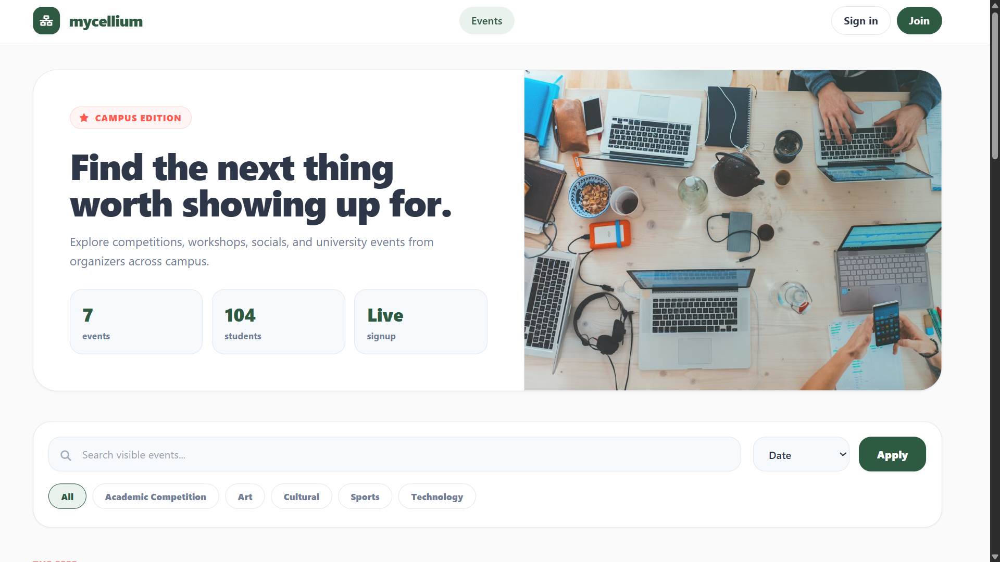
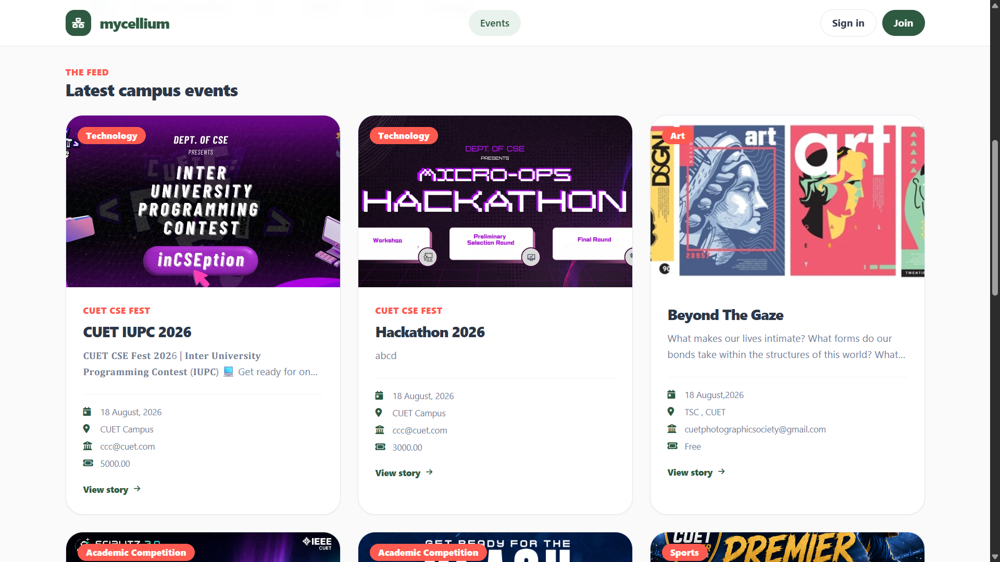

# Mycellium

Mycellium is a Spring Boot and Thymeleaf event management web app with separate flows for students and organizers. Students can register, log in, view events, RSVP, register for event segments, and receive notifications. Organizers can manage an organizer dashboard, create and edit events, upload event images, manage event categories, add event segments, and maintain event timelines.





## Tech Stack

- Java 17
- Spring Boot 3.5.0
- Thymeleaf
- Spring Data JPA
- MySQL
- Maven Wrapper
- Cloudinary for image uploads

## Features

- Student registration and login
- Organizer registration and login
- Organizer dashboard
- Event creation, editing, and deletion
- Event registration and RSVP support
- Student notifications
- Event categories
- Event segments
- Event timeline entries
- Cloudinary-backed event image uploads

## Local Setup

Follow these steps to clone and run the project locally.

### 1. Clone the Repository

```bash
git clone <your-repository-url>
cd mycellium
```

### 2. Install Prerequisites

Make sure these are installed on your machine:

- Java 17 or newer
- MySQL
- Git

### 3. Create the MySQL Database

Open MySQL Workbench or another MySQL client and run:

```sql
CREATE DATABASE mycellium;
```

### 4. Set Environment Variables

The app reads database and upload settings from environment variables.

```bash
DB_URL=jdbc:mysql://localhost:3306/mycellium
DB_USER=root
DB_PASSWORD=your_mysql_password
PORT=8080
CLOUDINARY_CLOUD_NAME=your_cloud_name
CLOUDINARY_API_KEY=your_api_key
CLOUDINARY_API_SECRET=your_api_secret
```

On Windows PowerShell, you can set them for the current terminal session like this:

```powershell
$env:DB_URL="jdbc:mysql://localhost:3306/mycellium"
$env:DB_USER="root"
$env:DB_PASSWORD="your_mysql_password"
$env:PORT="8080"
$env:CLOUDINARY_CLOUD_NAME="your_cloud_name"
$env:CLOUDINARY_API_KEY="your_api_key"
$env:CLOUDINARY_API_SECRET="your_api_secret"
```

Cloudinary variables are needed for organizer event image uploads.

### 5. Run the App

On Windows:

```bash
mvnw.cmd spring-boot:run
```

On macOS or Linux:

```bash
./mvnw spring-boot:run
```

### 6. Open the App

Open this URL in your browser:

```text
http://localhost:8080
```

## Build and Run the JAR

You can also build the project and run the generated JAR.

On Windows:

```bash
mvnw.cmd clean package
java -jar target/mycellium-0.0.1-SNAPSHOT.jar
```

On macOS or Linux:

```bash
./mvnw clean package
java -jar target/mycellium-0.0.1-SNAPSHOT.jar
```

## Notes

- The app creates and updates database tables automatically using JPA because `spring.jpa.hibernate.ddl-auto=update` is configured.
- Users can register as either `STUDENT` or `ORGANIZER`.
- Organizer event image uploads require valid Cloudinary environment variables.
- The default local port is `8080` unless `PORT` is set to another value.
